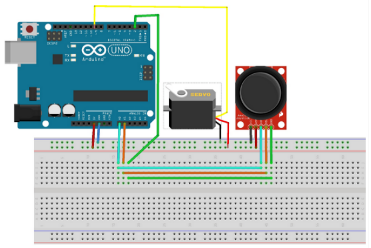

# Prática 1: Controle de Posição de Servo Motor com Joystick

## Objetivo
Controlar o movimento e o ângulo de um servo motor (`SG90`) em tempo real, utilizando um microcontrolador (Arduino) e um joystick analógico (`KY-023` ou similar) como dispositivo de entrada.

---

## Passo 1: Montagem e Análise Inicial do Circuito

A primeira etapa é montar o circuito de acordo com o diagrama de ligação.

### A. Montagem do Hardware
1.  **Servo Motor (Saída):** Conecte o pino de controle (`PWM`) do servo a uma porta digital do microcontrolador (ex: `D9` ou `D10`). O servo também deve ser conectado à alimentação (`VCC` de `5V`) e ao terra (`GND`).
2.  **Joystick (Entrada):**
    * O joystick (`KY-023`) é essencialmente composto por dois potenciômetros (eixos X e Y) e um botão (`SW`).
    * Conecte a alimentação (`VCC` e `GND`) do joystick à alimentação do Arduino.
    * Os pinos de saída analógica, **VRX** (eixo X) e **VRY** (eixo Y), devem ser conectados às portas **analógicas** do Arduino (ex: `A0` e `A1`).

> **Observação Crítica:** A forma como os pinos do joystick são ligados e identificados pode variar significativamente entre fabricantes. **Antes de ligar**, avalie cuidadosamente as marcações (VRX, VRY, `SW`) em seu módulo para garantir o mapeamento correto.

### B. Mapeamento de Entradas/Saídas
* **Entrada:** A leitura dos eixos X e Y do joystick fornecerá valores de tensão analógica, que serão convertidos pelo `ADC` (Conversor Analógico-Digital) do microcontrolador em valores numéricos (geralmente de 0 a 1023).
* **Saída:** O servo motor requer um sinal de `PWM` (Modulação por Largura de Pulso), onde o *duty cycle* (largura do pulso) determina a posição angular (ex: de 0° a 180°).

---

## Passo 2: Pesquisa e Documentação de Componentes

Antes de escrever o código, é fundamental compreender as características operacionais dos componentes.

1.  **Pesquisa de Componentes:** Realize uma pesquisa focada para obter informações detalhadas sobre as especificações elétricas e funcionais do joystick `KY-023` e do servo `SG90`.
2.  **Foco da Pesquisa:**
    * **Servo `SG90`:** Qual a faixa de `PWM` necessária para atingir a rotação mínima (`0°`) e máxima (`180°`)? (Geralmente, pulsos de `1ms` a `2ms`).
    * **Joystick `KY-023`:** Qual a faixa de leitura do pino analógico (`VRX/VRY`) quando o joystick está na posição central e nas posições extremas?
3.  **Documentação:**
    * Apresente as referências e tutoriais encontrados que descrevem o uso prático de ambos os componentes.
    * Analise se o procedimento encontrado na referência permitiu a conclusão da tarefa.
    * Relate quaisquer ambiguidades, erros ou dificuldades encontradas nas instruções propostas pela referência.

---

## Passo 3: Implementação do Código e Controle Dinâmico

Com os componentes montados e suas especificações compreendidas, crie o código para estabelecer o controle.

1.  **Lógica Central (Mapeamento):** A principal lógica de controle reside no mapeamento dos dados. O código deve ler o valor analógico de um dos eixos (ex: Eixo X, de 0 a 1023) e convertê-lo para a faixa de ângulo do servo (de 0 a 180). A função `map()` do Arduino é ideal para esta tarefa.
2.  **Controle do Servo:** Implemente o código para que a leitura do joystick (eixo X ou Y) controle diretamente o posicionamento angular do servo motor.
3.  **Apresentação e Análise:**
    * Apresente o código final criado na seção correspondente.
    * Inclua uma imagem nítida do sistema eletrônico montado na protoboard.
    * Relate e justifique quaisquer mudanças feitas no circuito original do **Passo 1** para garantir o funcionamento do código. Isso pode incluir mudanças nos pinos digitais ou analógicos utilizados.
    
## Simulação no WokWi
[Simulação do controle de um servo com joystick.](https://www.youtube.com/watch?v=SJ3V8ydx3C8)
