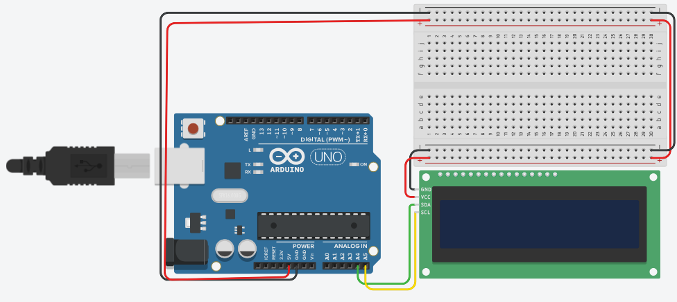

# M3 Súmario:

* Display de LCD
    * Uso do display sem I2C.
        * Aumentando saídas com 595.
    * **Uso do display com I2C.**
    * O que é I2C?
    * A comunicação na USB.
    * Módulo RS485.
    
## Uso do display com I2C.

O circuito apresentado ilustra a interconexão entre um microcontrolador Arduino e um **módulo LCD com interface I2C**. O principal benefício é a simplificação da fiação, pois o Arduino atua como **Master**, enviando comandos e dados de escrita de forma serial através do protocolo I2C. O módulo LCD atua como Slave, recebendo esses dados e convertendo o fluxo serial de 2 fios em sinais paralelos para controlar o display LCD.

A interconexão exibida entre o microcontrolador Arduino e o módulo LCD I2C utiliza o Arduino como o dispositivo Master, responsável por gerenciar a comunicação. O módulo I2C atua como um expansor de porta serial, recebendo dados bit a bit (serialmente) e traduzindo-os internamente para os sinais paralelos (RS, EN, D4, ..., D7) necessários para controlar o display LCD.

[Simulação do Circuito no Tinkercad](https://www.tinkercad.com/things/dHr1qUfIbiF-lcd-i2c)



O código aparece a seguir:
```cpp
#include <LiquidCrystal_I2C.h> // Inclui a biblioteca necessária para controlar o LCD via protocolo I2C.

// Define o objeto 'lcd' da classe LiquidCrystal_I2C.
// Os parâmetros são:
// 1. 0x27: Endereço I2C do módulo LCD (pode variar, sendo 0x27 ou 0x3F os mais comuns).
// 2. 20: Número de colunas do display LCD (20 caracteres de largura).
// 3. 4: Número de linhas do display LCD (4 linhas de altura).
LiquidCrystal_I2C lcd(0x27, 20, 4); 

void setup()
{
  // --- Inicialização do LCD ---
  
  lcd.init(); // Inicializa a interface I2C e o display LCD.
  // A chamada lcd.init() geralmente é repetida para garantir a inicialização correta 
  // em alguns módulos I2C, embora tecnicamente uma vez deva ser suficiente.
  lcd.init(); 

  // --- Configurações Iniciais ---
  
  lcd.backlight(); // Liga a luz de fundo (backlight) do display LCD.
  
  // Define a posição do cursor (coluna, linha) onde a próxima escrita começará.
  // Coluna 0, Linha 0 (a contagem começa em 0).
  lcd.setCursor(0, 0); 
  
  // Imprime a primeira mensagem na posição definida.
  lcd.print("AeroWeek 2025"); 
  
  // Define a posição do cursor na Linha 1 (a segunda linha).
  // Coluna 0, Linha 1.
  lcd.setCursor(5, 1); 
  
  // Imprime uma segunda mensagem na Linha 1.
  lcd.print("21/10/25");
}


void loop()
{
  // Esta função está vazia, o que significa que o display LCD
  // exibirá apenas as mensagens definidas no setup() e não será atualizado.
  // Em projetos futuros, a lógica principal (como leitura de sensores) iria aqui.
}
```
