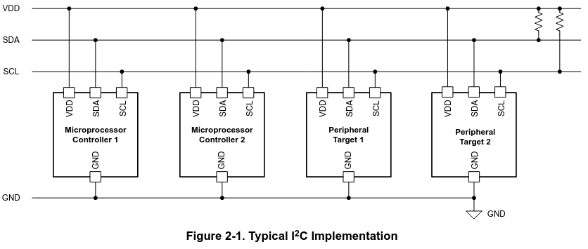
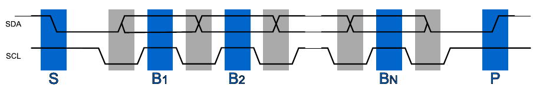
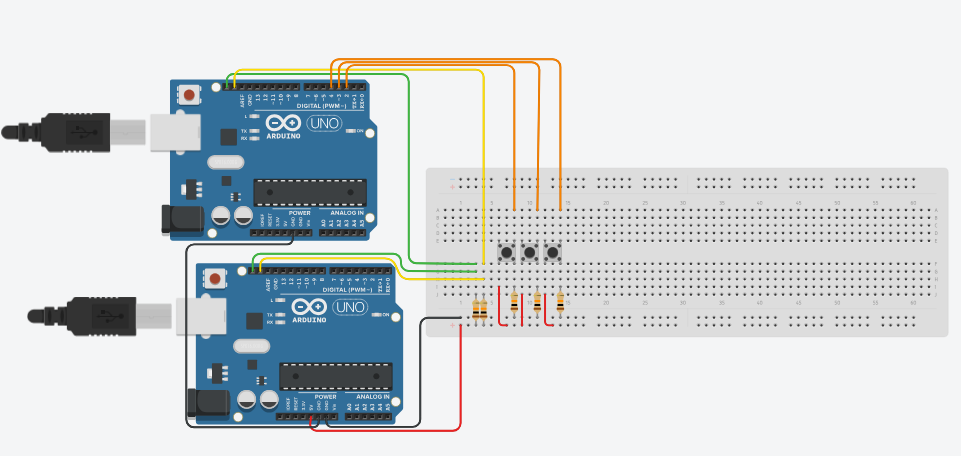

# M3 Sumário:

* Display de LCD
    * Uso do display sem I2C.
        * Aumentando saídas com 595.
    * Uso do display com I2C.
    * **O que é I2C?**
    * A comunicação na USB.
    * Módulo RS485.
    
## Sobre I2C.

Segundo documentação da [Texas Instruments](https://www.ti.com/lit/an/sbaa565/sbaa565.pdf?ts=1761122391716&ref_url=https%253A%252F%252Fwww.google.com%252F), 

"I2C é um protocolo de comunicação serial de dois fios que utiliza uma linha de dados serial (SDA) e uma linha de clock serial (SCL). O protocolo suporta múltiplos dispositivos de destino em um barramento de comunicação e pode também suportar múltiplos controladores que enviam e recebem comandos e dados. A comunicação é enviada em pacotes de bytes com um endereço exclusivo para cada dispositivo de destino.".

A partir da documentação citada, podemos descrever o uso do I2C na prática.



Da análise da figura podemos evidenciar:
* Vantagens
    * Simplificação do hardware
    * Aumento da taxa de transmissão devido a redução de problemas de sincronia
    * Economia de cabos
* Desvantagens
    * Necessidade de circuitos extras
    * Maior complexidade no código
    
A comunicação é feita como nos LCD's, mas nesse caso apenas um bit é enviado por vez:
* SDA e SCL começam em nível alto.
* SDA é levado para nível baixo como sinal de início.
* SCL é levado para nível baixo.
* o primeiro bit (menos significativo) é colocado em SDA.
* SCL é levado para nível alto, aguarda-se o tempo do sistema e abaixa-se novamente SCL repete-se o processo do item 3 até o fim da transmissão.
* SDA é levado para nível alto indicando fim de transmissão.
* As regiões em azul indicam bits válidos.
* As regiões em cinza representam os momentos em que o sinal de dados pode mudar (com clock baixo).



Podemos ver o funcionamento do I2C no tinker: [Simulação do Circuito no Tinkercad](https://www.tinkercad.com/things/kUrpoqgoo5E-i2c?sharecode=JCHJpm7kp9qd-hrdEJDQC7-FkI6IqwQEVC_OLFBKoUA).



O código usado é mostrado a seguir:
```cpp
// C++ code
//
#define SDA_PIN 18
#define SCL_PIN 19

#define KEYPAD_1_PIN 13
#define KEYPAD_2_PIN 12
#define SO_CLK_PIN   11
#define SO_EN_PIN    10
#define PWM_PIN       9
#define SO_DATA_PIN   8
#define LCD_RS_PIN    7
#define LCD_EN_PIN    6
#define DISP_4_PIN    5
#define LED_BLUE_PIN  4
#define DISP_3_PIN    4 
#define LED_GREEN_PIN 3
#define DISP_2_PIN    3
#define LED_RED_PIN   2
#define DISP_1_PIN    2
#define TX_PIN        1
#define RX_PIN        0
void i2cInit(void) {
    pinMode(SDA_PIN,INPUT);
    pinMode(SCL_PIN,INPUT);
}

#define I2CSPEED 10
void I2C_delay(void) { volatile int v; int i; for (i=0; i < I2CSPEED/2; i++) v; }
//configura SCL como entrada e retorna o valor do canal
int read_SCL(void){
	pinMode(SCL_PIN,INPUT);
	return digitalRead(SCL_PIN);
}

//configura SDA como entrada e retorna o valor do canal
int read_SDA(void){ 
	pinMode(SDA_PIN,INPUT);
	return digitalRead(SDA_PIN);
}

//Envia um bit zero(0)
void clear_SCL(void){
	pinMode(SCL_PIN,OUTPUT);
	digitalWrite(SCL_PIN,LOW);
}
//Envia um bit um(1)
void set_SDA(void){
	//o bit um é feito colocando o terminal como entrada e permitindo que o pull-up leve o terminal para 1
	pinMode(SDA_PIN,INPUT);
}

//Abaixa o nivel do canal de clock
void clear_SDA(void){
	pinMode(SDA_PIN,OUTPUT);
	digitalWrite(SDA_PIN,LOW);
}

static int started = 0; // armazena é a primeira vez
void i2c_start(void) {
	if (started) {//se já estiver iniciado, prepara para reenviar o bit de start
		set_SDA();
		I2C_delay();
		//Aguarda o clock ficar disponível (clock streching)
		while (read_SCL() == 0);
		I2C_delay();
	}
	// SCL está alto, mudar SDA de 1 para 0
	clear_SDA();
	I2C_delay();
	clear_SCL();
	started = true;
}

void i2c_stop(void){
	clear_SDA();
	I2C_delay();
	// Aguarda o clock ficar disponível (clock streching)
	while (read_SCL() == 0);
	I2C_delay();
	// SCL está alto, mudar SDA de 0 para 1
	set_SDA();
	I2C_delay();
	started = false;
}

// Escreve um bit no barramento
void i2c_write_bit(int bit) {
	if (bit) {
		set_SDA();
	} else {
		clear_SDA();
	}
	I2C_delay();
	while (read_SCL() == 0); // Clock stretching
	I2C_delay();
	clear_SCL();
	I2C_delay();
}

// Lê um bit do barramento
int i2c_read_bit(void) {
	int bit;
	read_SDA();//configura SDA como entrada
	I2C_delay();
	while (read_SCL() == 0); // Clock stretching
	// SCL está alto, o dado está disponível
	bit = read_SDA();
	I2C_delay();
	clear_SCL();
	I2C_delay();
	return bit;
}

// Escreve um byte no barramento I2C.
int i2cWrite(int send_start, int send_stop, unsigned char byte) {
	int bit;
	int nack;
	if (send_start) {
		i2c_start();
	}
	for (bit = 0; bit < 8; bit++) {
		i2c_write_bit((byte & 0x80) != 0);
      						//1000 0000
		byte <<= 1;
             //ex 1010 0101 depois o byte fica 0100 1010 
	}
	nack = i2c_read_bit();
	if (send_stop) {
		i2c_stop();
	}
	return nack;
}

// Lê um byte do barramento I2C
unsigned char i2cRead(int nack, int send_stop) {
	unsigned char byte = 0;
	unsigned int bit;
	for (bit = 0; bit < 8; bit++) {
		byte = (byte << 1) | i2c_read_bit();
                // deslocar para esquerda e comparar com o resultado obtido...
	}
	i2c_write_bit(nack);
	if (send_stop) {
		i2c_stop();
	}
	return byte;
}

//botoes
int checkButton(void) {
  int b;
  
  b = 0;
  // obs bit menos significativo eh <RW>
  if (digitalRead(2)) b = 1;
  if (digitalRead(3)) b = 2;
  if (digitalRead(4)) b = 3;
  
  // checar botao
  if (b != 0) {
    //Serial.println("botao");
  }
  return b;
}

//----
void setup()
{
  Serial.begin(9600);
  // ID
  byte me = 0x00;
  i2cInit();
  
  //botões
  pinMode(DISP_1_PIN, INPUT); //c
  pinMode(DISP_2_PIN, INPUT); //b
  pinMode(DISP_3_PIN, INPUT); //a
  
}

void loop()
{
  int bstat;
  byte apos, endereco;
  
  delay(100);
  bstat = checkButton();
  if (bstat > 0) {
    if (bstat == 1) apos = 0x03;
    if (bstat == 2) apos = 0x05;
    if (bstat == 3) apos = 0x07;
    					// obs: 0 bit menos significativo deve ser 1 para leitura
    
    // enviar endereço + posicao do array
    endereco = 0xE0 + apos;
    //Serial.println(endereco, HEX);
    unsigned char nack = i2cWrite(1, 0, endereco);
    //ler
    //i2c_read_bit();
    Serial.println(i2cRead(1,1),DEC);
    bstat = 0;
  }
}
```
