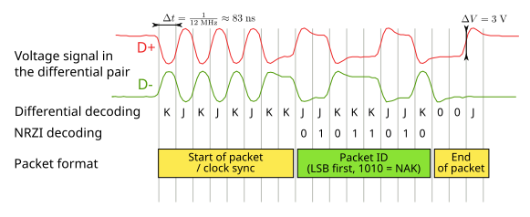

# M3 Sumário:

* Display de LCD
    * Uso do display sem I2C.
        * Aumentando saídas com 595.
    * Uso do display com I2C.
    * O que é I2C?
    * **A comunicação na USB.**
    * Módulo RS485.
    
## USB 1.0 simplificado

O protocolo **USB 1.0** utiliza um cabo de quatro canais, sendo dois para alimentação e dois, **D+** e **D-**, para a transmissão de dados. A principal característica de robustez é o **princípio de sinalização diferencial** [1], onde os sinais enviados nos canais **D+** e **D-** são **opostos** (**um é o inverso do outro**). Ao subtrair esses sinais no receptor, qualquer ruído eletromagnético (**ruído de modo comum**) captado simultaneamente pelos dois fios é efetivamente cancelado, resultando em uma comunicação de dados altamente confiável e resistente a interferências. ([REF(Petteri Aimonen)](https://commons.wikimedia.org/wiki/File:USB_signal_example.svg))

[1] técnica de transmissão de dados que utiliza dois sinais complementares (um com a informação e outro com a informação invertida) para reduzir o ruído e aumentar a integridade do sinal.

"Ilustração do sinal USB no nível elétrico. É retratado um pacote Negative Acknowledge (NAK) de um dispositivo USB 1.1 de velocidade total (full-speed). O pacote NAK consiste no byte de sincronização, no campo ID do pacote e no marcador de fim de pacote. Pacotes de dados teriam o campo de endereço (address field) e a carga útil (payload) entre o ID do pacote e o marcador de fim de pacote." ([REF(Petteri Aimonen)](https://commons.wikimedia.org/wiki/File:USB_signal_example.svg))
