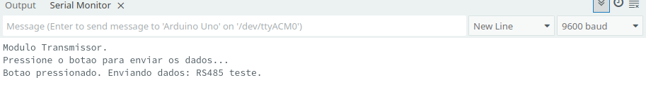
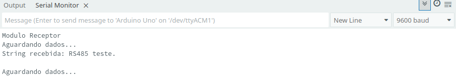

# M3 Sumário:

* Display de LCD
    * Uso do display sem I2C.
        * Aumentando saídas com 595.
    * Uso do display com I2C.
    * O que é I2C?
    * A comunicação na USB.
    * **Módulo RS485.**
    
## USB 1.0 simplificado

Em 1983, a Electronics Industries Association (EIA) aprovou uma nova norma de transmissão balanceada chamada RS-485. Encontrando ampla aceitação e uso em aplicações industriais, médicas e de consumo, o RS-485 se tornou o "trabalhador bruto" da interface da indústria. Este relatório de aplicação apresenta diretrizes de projeto para engenheiros novos na norma RS-485 que podem ajudá-los a realizar um projeto de transmissão de dados robusto e confiável no menor tempo possível.([Texas Instruments](https://www.ti.com/lit/an/slla272d/slla272d.pdf?ts=1763216356438))

Níveis de Sinal

* Saída Mínima do Driver: 1.5 V diferencial através de uma carga de 54 Ω.

* Entrada Mínima do Receptor: 200 mV diferencial.

Estes valores fornecem margem suficiente para uma transmissão de dados confiável, mesmo sob severa degradação do sinal, o que torna o RS-485 adequado para redes de longa distância em ambientes ruidosos.([Texas Instruments](https://www.ti.com/lit/an/slla272d/slla272d.pdf?ts=1763216356438))

O uso com o arduino pode ser resumido com a figura mostrada abaixo.


Nesta figura, temos dois arduinos, um é o transmissor e o outro é o Receptor. 

Uma descrição para os pinos segue abaixo.

* RO (Receive Output) – Recebe os dados pela serial RS232
* RE (Receive Enable) – Habilita a recepção de dados
* DE (Data Enable) – Habilita a transmissão de dados
* DI (Data Input) – Envia os dados pela serial RS232

O mesmo módulo pode ser usado tanto para transmissão como para recepção, bastando habilitar ou desabilitar os pinos RE e DE.

A comunicação RS485 é capaz de cobrir grandes distâncias, tendo uma grande imunidade a ruídos quando utilizada de maneira adequada. Entre suas principais características, podemos destacar:

* Comunicação à 2 fios
* Comunicação a longas distâncias (até 1.200 m)
* Possibilidade de ter até 32 nós/estações na rede RS485 em um mesmo barramento
* Velocidade de até 35 Mbps

Texto baseado nos artigos dos links: [link1](https://arduinoecia.com.br/como-usar-comunicacao-rs485-com-arduino/?srsltid=AfmBOoqkyjE0yYlsMifJxZf6_F0r4wT-gx0ysKvMzAmnOXaFEU0R2Wvv), [link2](https://www.citisystems.com.br/rs485/).

Para a transmissão, podemos usar o código abaixo.
```cpp
//Programa: Comunicação RS485 com Arduino - Transmissor
// baseado no código de Arduino e Cia
#include <SoftwareSerial.h> // Inclui a biblioteca para comunicação serial via software

// Definir tamanho do buffer da string (tamanho máximo da mensagem + 1 para o terminador nulo '\0')
#define nChar            16
char message[nChar] = "RS485 teste."; // A mensagem a ser transmitida, com um buffer de 16 bytes

// botão
#define bPin  2  // Define o pino digital 2 para o botão (ou 3, se preferir)

//Pinos de comunicacao serial do modulo RS485
#define Pino_RS485_RX    10 // Define o pino 10 como RX (recepção) para a serial software
#define Pino_RS485_TX    11 // Define o pino 11 como TX (transmissão) para a serial software

//Pino de controle transmissao/recepcao (DE/RE no módulo RS485)
#define SSerialTxControl 3 // Define o pino 3 para controlar a direção do módulo (transmitir ou receber)
#define RS485Transmit    HIGH // Nível lógico ALTO para habilitar a transmissão
#define RS485Receive     LOW // Nível lógico BAIXO para habilitar a recepção

//Define led 13 para mostrar atividade na comunicacao
#define Pin13LED         13 // Define o pino 13 (LED embutido na maioria dos Arduinos)

//Cria a serial por sofware para conexao com modulo RS485
SoftwareSerial RS485Serial(Pino_RS485_RX, Pino_RS485_TX);

// Função para exibir mensagens no Serial Monitor (para depuração)
void umsg (int task) {
  // Uso de switch-case para melhor organização e performance na seleção de mensagens.
  switch (task) {
    case 0:
      Serial.println("Modulo Transmissor.");
      break;
    case 1:
      Serial.println("Pressione o botao para enviar os dados...");
      break;
    case 2:
      Serial.print("Botao pressionado. Enviando dados: ");
      break;
    case 3:
      Serial.println(); // Pula uma linha
      break;
    case 4:
      Serial.print("Msg maior que o buffer, char descartado: "); // Etiqueta mais precisa para o char descartado (esta mensagem não é usada no transmissor, mas está disponível)
      break;
  }
}

// botão
volatile bool bPressed = false; // Variável volátil para indicar que o botão foi pressionado (acessada pela ISR)
long bTime  = millis(); // Variável para controle de tempo (debounce simples ou anti-repique)

// Função de Interrupção de Serviço (ISR) - Chamada automaticamente quando o botão é pressionado
void fButton() {
  // Esta função é a Interrupt Service Routine (ISR)
  // Mantenha-a curta e evite delays ou operações complexas
  // Implementa um simples anti-repique por tempo (5 segundos de intervalo mínimo entre pressionamentos registrados)
  if ( (millis() - bTime) > 5000 ) { 
    bPressed = true;
    bTime = millis();
  }
}

// Função que gerencia o envio da mensagem via RS485
void sendMsg() {
  //digitalWrite(Pin13LED, HIGH); // Acende o LED para indicar transmissão
  umsg(2); // Exibe "Botao pressionado. Enviando dados!" no monitor serial
  Serial.println(message);

  // Habilita o modulo para transmissao (configura o pino DE/RE como HIGH)
  digitalWrite(SSerialTxControl, RS485Transmit); 

  // Envia a string pela serial software (e, portanto, pelo módulo RS485)
  RS485Serial.println(message); 

  // Desabilita o modulo para transmissao (configura o pino DE/RE como LOW para voltar a receber, se necessário)
  digitalWrite(SSerialTxControl, RS485Receive); 
  
  // resetar estado do botão (prepara para o próximo pressionamento)
  bPressed = false;
}

// Função de configuração inicial
void setup(){
  // Inicializa a serial do Arduino para depuração no PC (9600 bps)
  Serial.begin(9600); 
  umsg(0); // Exibe "Modulo Transmissor."
  umsg(1); // Exibe "Pressione o botao para enviar os dados..."
  
  pinMode(Pin13LED, OUTPUT); // Configura o pino do LED como saída
  pinMode(SSerialTxControl, OUTPUT); // Configura o pino de controle de direção como saída

  // Inicializa a serial do modulo RS485 (4800 bps - deve ser a mesma velocidade no receptor)
  RS485Serial.begin(4800); 

  // Seta o pino A0 como entrada e habilita o pull up (esta linha parece redundante ou um resquício, A0 não é usado no loop principal para leitura de botão, apenas bPressed é usado)
  pinMode(A0, INPUT_PULLUP); 
  
  pinMode(bPin, INPUT_PULLUP); // Usa o resistor pull-up interno no pino 2 para o botão

  // Anexa a função de interrupção fButton ao evento de borda de descida (FALLING) no pino 2
  // FALLING significa que a interrupção é acionada quando o botão é pressionado (pino vai de HIGH para LOW)
  attachInterrupt(digitalPinToInterrupt(bPin), fButton, FALLING); 
}

// Loop principal do programa
void loop(){
  // Verifica se o botao foi pressionado (a leitura de A0 é redundante, pois a lógica de envio depende apenas de bPressed)
  int  valor = digitalRead(A0); // A leitura desta variável 'valor' não é utilizada posteriormente.

  // Se a flag bPressed foi definida como true pela ISR, chama a função de envio
  if (bPressed)  
    sendMsg(); // Executa o envio da mensagem
}
```

No caso do arduino usado como receptor, podemos usar o código abaixo.
```cpp
// --------------------------------------------------
// Programa: Comunicação RS485 com Arduino - Receptor
// modificado do código de "Arduino e Cia"
// --------------------------------------------------

// Inclui a biblioteca SoftwareSerial, necessária para criar uma comunicação serial em pinos digitais que não são os pinos 0 e 1 (TX/RX hardware).
// ver https://docs.arduino.cc/learn/built-in-libraries/software-serial/
#include <SoftwareSerial.h>

// Definir tamanho do buffer da string (tamanho máximo da mensagem + 1 para o terminador nulo '\0')
#define nChar            16

// Define constantes para os pinos usados. Isso torna o código mais legível e fácil de modificar.
#define Pino_RS485_RX    10 // Pino 10 configurado como RX (Recebimento de dados do módulo RS485 para o Arduino)
#define Pino_RS485_TX    11 // Pino 11 configurado como TX (Transmissão de dados do Arduino para o módulo RS485)

// Pino de controle transmissao/recepcao (DE/RE do módulo RS485, Driver Enable/Receiver Enable)
#define SSerialTxControl 3 

// Define os níveis lógicos para alternar entre os modos de operação (normalmente HIGH para Transmitir, LOW para Receber)
#define RS485Transmit    HIGH
#define RS485Receive     LOW

// Define led 13 para mostrar atividade na comunicacao (LED embutido na maioria das placas Arduino)
#define Pin13LED         13

// Cria uma instância da SoftwareSerial chamada 'RS485Serial'.
// Ela usará o Pino_RS485_RX para receber e o Pino_RS485_TX para transmitir.
SoftwareSerial RS485Serial(Pino_RS485_RX, Pino_RS485_TX);

// Variável booleana que não está sendo usada no momento, pode ser removida.
// boolean stringComplete = false; 

/**
 * @brief Função utilitária para imprimir mensagens de status no Serial Monitor (Hardware Serial).
 * 
 * @param task Código da mensagem a ser exibida.
 */
void umsg (int task) {
 // Uso de switch-case para melhor organização e performance na seleção de mensagens.
 switch (task) {
  case 0:
    Serial.println("Modulo Receptor");
    break;
  case 1:
    Serial.println("Aguardando dados...");
    break;
  case 2:
    Serial.print("String recebida: ");
    break;
  case 3:
    Serial.println(); // Pula uma linha
    break;
  case 4:
    Serial.print("Msg maior que o buffer, char descartado: "); // Etiqueta mais precisa para o char descartado
    break;
 }
}

// verificar a string recebida.
// String receivedString = ""; // Comentado, pois agora usamos um char array para melhor gerenciamento de memória.

// Buffer de caracteres onde a mensagem recebida será armazenada.
// O tamanho é nChar (16), incluindo espaço para o terminador nulo ('\0').
char rxString[nChar]; 

// Índice/contador para controlar a posição atual de escrita no buffer rxString.
unsigned int iChar = 0; 

/**
 * @brief Função responsável por verificar o buffer da RS485Serial e montar a string recebida caractere por caractere.
 */
void checkStringSerial () {
  // Se houver caracteres disponíveis no buffer de hardware da SoftwareSerial (que tem 64 bytes por padrão):
  if (RS485Serial.available()) {
    char incomingChar = (char)RS485Serial.read(); // Lê um único caractere

    // Define o caractere de terminação como quebra de linha ('\n').
    // O transmissor deve enviar este caractere no final da mensagem.
    if (incomingChar == '\n') {
      // Quando a linha completa é recebida:

      // Adiciona o terminador nulo ao final da string no buffer (requisito para funções C como Serial.println() e outras).
      rxString[iChar] = '\0'; 
      umsg(2); // Imprime "String recebida: "
      Serial.println(rxString); // Imprime a string completa (terminada em '\0') no monitor serial do PC

      // Limpa o contador para a próxima mensagem. Não é necessário limpar o array inteiro se você sobrescrever os dados.
      iChar = 0; 

      // limpar buff
      clearSerialBuffer();

      // Feedback visual no monitor serial
      umsg(3); // Pula uma linha
      umsg(1);  // Imprime "Aguardando dados..."
      
    } else {
      // Se não for o terminador, anexa o caractere ao array, verificando o limite do buffer.

      // Verifica se o índice atual é menor que o tamanho máximo definido (nChar).
      // Subtraímos 1 (iChar < nChar - 1) se quisermos garantir que o '\0' sempre caiba no final.
      if (iChar < nChar - 1) { 
        rxString[iChar] = incomingChar;
        iChar++; // Incrementa o índice para a próxima posição vazia
      } else {
        // Se o buffer estiver cheio antes de receber o '\n', descartamos o novo caractere e avisamos.
        umsg(4); 
        Serial.println(incomingChar); // Mostra qual caractere foi descartado
      }
    }
  }
}

void clearSerialBuffer() {
  while (RS485Serial.available() > 0) {
    RS485Serial.read(); // Lê o byte, mas não faz nada com ele (descarta)
  }
}

void setup()
{
  // Inicializa a comunicação serial via USB para depuração no PC (Hardware Serial).
  Serial.begin(9600);
  umsg(0); // Imprime "Modulo Receptor"

  // Configuração dos pinos digitais como OUTPUT
  pinMode(Pin13LED, OUTPUT);
  pinMode(SSerialTxControl, OUTPUT); // Define o pino de controle do módulo RS485 como saída

  // Coloca o modulo RS485 em modo de recepcao por padrão (DE/RE LOW)
  digitalWrite(SSerialTxControl, RS485Receive);

  // limpar buff
  clearSerialBuffer(); 

  // Inicializa a serial por software para comunicação com o módulo RS485 (4800 bps).
  RS485Serial.begin(4800);
  
  umsg(1); // Imprime "Aguardando dados..."
}

void loop()
{
  // Chama repetidamente a função que verifica e processa os dados recebidos.
  checkStringSerial();
  
  // O loop() fica livre para executar outras tarefas enquanto aguarda dados.
}
```

Pela serial, podemos ver os resultados do envio e recebimento de dados. Veja a seguir:


