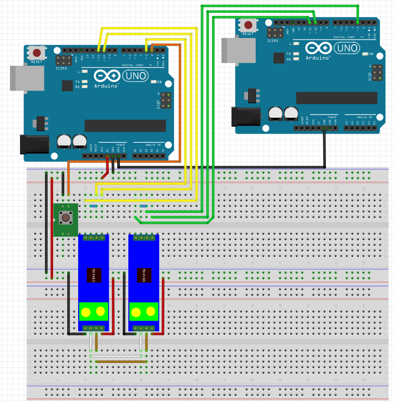

# M3 Sumário:

* Display de LCD
    * Uso do display sem I2C.
        * Aumentando saídas com 595.
    * Uso do display com I2C.
    * O que é I2C?
    * A comunicação na USB.
    * **Módulo RS485.**
    
## USB 1.0 simplificado

Em 1983, a Electronics Industries Association (EIA) aprovou uma nova norma de transmissão balanceada chamada RS-485. Encontrando ampla aceitação e uso em aplicações industriais, médicas e de consumo, o RS-485 se tornou o cavalete de trabalho da interface da indústria. Este relatório de aplicação apresenta diretrizes de projeto para engenheiros novos na norma RS-485 que podem ajudá-los a realizar um projeto de transmissão de dados robusto e confiável no menor tempo possível.([Texas Instruments](https://www.ti.com/lit/an/slla272d/slla272d.pdf?ts=1763216356438))

Níveis de Sinal

* Saída Mínima do Driver: 1.5 V diferencial através de uma carga de 54 Ω.

* Entrada Mínima do Receptor: 200 mV diferencial.

Estes valores fornecem margem suficiente para uma transmissão de dados confiável, mesmo sob severa degradação do sinal, o que torna o RS-485 adequado para redes de longa distância em ambientes ruidosos.([Texas Instruments](https://www.ti.com/lit/an/slla272d/slla272d.pdf?ts=1763216356438))

O uso com o arduino pode ser resumido com a figura mostrada abaixo.



Neste figura, temos dois arduinos, um é o transmissor e o outro é o Receptor. 

Uma descrição para os pinos segue abaixo.

* RO (Receive Output) – Recebe os dados pela serial RS232
* RE (Receive Enable) – Habilita a recepção de dados
* DE (Data Enable) – Habilita a transmissão de dados
* DI (Data Input) – Envia os dados pela serial RS232

O mesmo módulo pode ser usado tanto para transmissão como para recepção, bastando habilitar ou desabilitar os pinos RE e DE.

A comunicação RS485 é capaz de cobrir grandes distâncias, tendo uma grande imunidade a ruídos quando utilizada de maneira adequada. Entre suas principais características, podemos destacar:

* Comunicação à 2 fios
* Comunicação a longas distâncias (até 1.200 m)
* Possibilidade de ter até 32 nós/estações na rede RS485 em um mesmo barramento
* Velocidade de até 35 Mbps

Texto baseado nos artigos dos links: [link1](https://arduinoecia.com.br/como-usar-comunicacao-rs485-com-arduino/?srsltid=AfmBOoqkyjE0yYlsMifJxZf6_F0r4wT-gx0ysKvMzAmnOXaFEU0R2Wvv), [link2](https://www.citisystems.com.br/rs485/).

Para a transmissão, podemos usar o código abaixo.
```cpp

```

