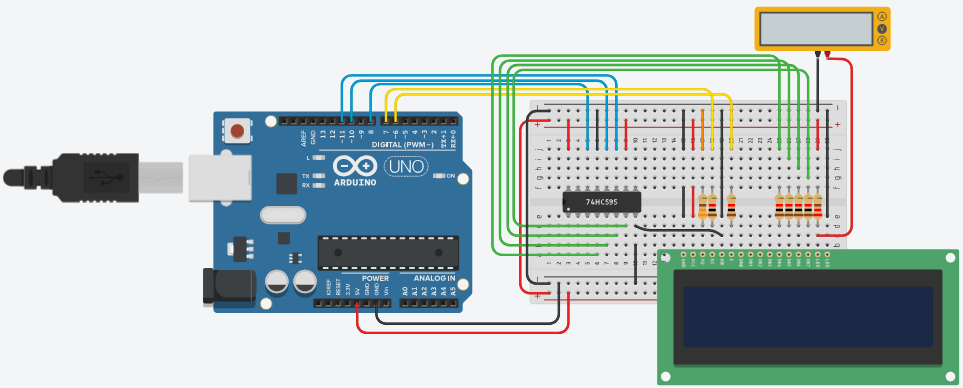

# Conteúdo do Módulo 03

## Saídas e comunicação simples

* Display de LCD
    * Uso do display sem I2C.
        * Aumentando saídas com 595.
    * Uso do display com I2C.
    * O que é I2C?
    * A comunicação na USB.
    * Módulo RS485.
    
### Uso do display sem I2C.

O circuito apresentado exibe a interconexão entre um microcontrolador Arduino, o **CI 74HC595** (Shift Register) e um **módulo LCD**. O principal objetivo dessa arquitetura é a **economia de pinos** do Arduino, utilizando o 74HC595 para ampliar as saídas digitais. O Arduino envia os comandos e dados de escrita para o LCD em um formato serial (bit a bit) ao CI 595, que armazena temporariamente (em seu buffer) e disponibiliza o byte completo para a configuração e o acionamento dos pinos de controle e dados do LCD.



O código aparece a seguir:
```cpp


LCD I2C
https://www.tinkercad.com/things/dHr1qUfIbiF-lcd-i2c

LCD
https://www.tinkercad.com/things/cyCSrCmWMQF-lcd

tinker-I2C
https://www.tinkercad.com/things/kUrpoqgoo5E-i2c?sharecode=JCHJpm7kp9qd-hrdEJDQC7-FkI6IqwQEVC_OLFBKoUA

uso do RS485
https://arduinoecia.com.br/como-usar-comunicacao-rs485-com-arduino/?srsltid=AfmBOorpzX0uIcYsL-Si9SpWYHENh90-he4W1iU2O7KxmYvLlb1tCYrK
