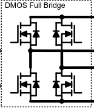
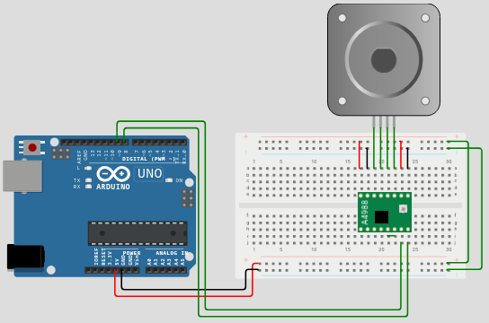
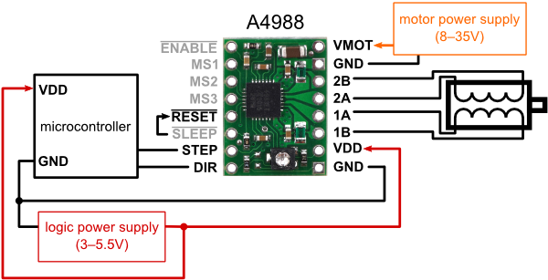

# Sumário

## Motores II

* **Uso do L293D ou A4988.**
* Controle de motor DC e/ou de Passo e/ou servo.
* Microcontrolador standalone

## Perspectivas futuras
* STM32
* FREERTOS

A partir da folha de dados [Allegro Microsystems](https://www.allegromicro.com/en/products/motor-drivers/brush-dc-motor-drivers/a4988), podemos resumir:

O A4988 é um driver de motor de passo bipolar projetado para **micropassos** (de passo completo até 1/16 de passo) com capacidade de saída de até 35 V e ±2 A. Sua principal característica é o **tradutor integrado**, que simplifica a interface: basta um pulso na entrada STEP para mover o motor em um micropasso, eliminando a necessidade de lógica de controle complexa ou microprocessadores avançados. O dispositivo também gerencia a corrente através de um regulador com tempo de off fixo, utilizando um modo de **decaimento misto** (rápido seguido por lento) para reduzir o ruído do motor, aumentar a precisão do passo e otimizar a dissipação de energia.

A folha de dados fala que o A4988 usa "full bridges", com transistores FET DMOS para os drivers do motor, descrevendo a arquitetura interna do que chamamos de Ponte H, permitindo a comutação (processo eletrônico de chavear a direção da corrente na bobina do motor para controlar seu movimento) da corrente nas bobinas.



Na página do simulador sugerido para uso do a4988 e do motor de passo, temos uma documentação explicando cada pino do módulo com a4988 e como configurar, [veja a referência](https://docs.wokwi.com/pt-BR/parts/wokwi-a4988). O experimento é mostrado na figura abaixo:




Uma visão mais detalhada com a descrição dos pinos é mostrada abaixo.



[Referência](https://d229kd5ey79jzj.cloudfront.net/291/images/291_3_H.png)

O código é mostrado a seguir.

```cpp
// Inclui a Biblioteca AccelStepper, gerencia o controle do motor de passo,
// permitindo a definição de aceleração/desaceleração e movimento suave.
#include <AccelStepper.h>
 
// --- Definição de Pinos ---

// Define o pino de Direção (Direction Pin - DIR)
// Este pino é usado para controlar o sentido de rotação do motor (horário/anti-horário).
const int DIR = 8;

// Define o pino de Passo (Step Pin - STEP)
// Este pino recebe os pulsos do Arduino, e cada pulso move o motor em um passo/micropasso.
const int STEP = 9;

// Variável de controle (não utilizada neste código simples, mas comum em lógica mais complexa)
int task = 0;
 
// --- Configuração da Biblioteca AccelStepper ---

// Defina o tipo de interface do motor
// O valor '1' (ou AccelStepper::DRIVER) indica que estamos usando um driver externo
// que requer apenas um pino de pulso (STEP) e um pino de direção (DIR),
// como é o caso do A4988 ou DRV8825.
#define InterfaceMotor 1
 
// Cria uma instância (objeto) da biblioteca AccelStepper
// Stepper: Nome do objeto que controlará o motor.
// InterfaceMotor: Tipo de driver (1 para A4988).
// STEP: O pino que recebe os pulsos.
// DIR: O pino que define a direção.
AccelStepper Stepper(InterfaceMotor, STEP, DIR);
 
// --- Função Setup (Executada uma vez) ---
void setup() {
  // Define os parâmetros de movimento e inicializa o motor:
  
  // Define a velocidade máxima em passos por segundo.
  Stepper.setMaxSpeed(1000);     // 1000 passos/segundo (ajuste conforme o motor e driver)
  
  // Define a aceleração em passos por segundo por segundo (passos/s²).
  // Controla a suavidade da partida e da parada do motor.
  Stepper.setAcceleration(50);   // 50 passos/s²
  
  // Define a velocidade inicial ou regular de movimento (usada em Stepper.runSpeed()).
  // Embora Stepper.moveTo() use a velocidade máxima, esta é uma boa prática.
  Stepper.setSpeed(200);         // 200 passos/segundo
  
  // Define a posição alvo (destino) em passos para onde o motor deve se mover.
  // O motor tentará mover-se 200 passos a partir da posição inicial (0).
  Stepper.moveTo(200);           
}
 
// --- Função Loop (Executada repetidamente) ---
void loop() {
  // Verifica se o motor atingiu sua posição alvo (distanceToGo() retorna 0 quando a posição é alcançada).
  if (Stepper.distanceToGo() == 0) {
    // Se a posição foi alcançada, define uma nova posição alvo.
    // Stepper.currentPosition() retorna a posição atual do motor.
    // O sinal de negativo (-) inverte a direção do movimento.
    // Ex: Se o motor estiver em +200, o novo alvo será -200, fazendo-o retornar à posição inicial (0).
    Stepper.moveTo(-Stepper.currentPosition());
  }
 
  // Função principal da biblioteca:
  // Esta função deve ser chamada o mais rápido possível no loop.
  // Ela calcula o próximo passo, verifica a aceleração/desaceleração e aciona o pino STEP conforme necessário.
  Stepper.run();
}
```
