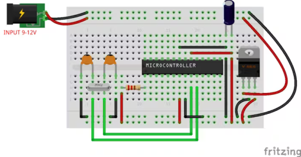

# Sumário

## Motores II

* Uso do L293D ou A4988.
* Controle de motor DC e/ou de Passo e/ou servo.
* **Microcontrolador standalone**

## Perspectivas futuras
* STM32
* FREERTOS

## Procedimento: Programação do ATmega328 Standalone (Usando Arduino como ISP)

Este guia detalha a montagem do circuito mínimo do $\text{ATmega}328$ em um protoboard e o processo de gravação do Bootloader, utilizando uma placa $\text{Arduino}$ $\text{Uno}$ como Programador In-System Programmer ($\text{ISP}$).

### 1. Montagem do Circuito Mínimo do ATmega328

O primeiro passo é montar o circuito básico de suporte que permite o funcionamento do $\text{ATmega}328$ fora da placa $\text{Arduino}$ (Standalone).

1.  **Conexões de Alimentação e Terra:**
    * **$\text{VCC}$:** Conecte o **$\text{Pin } 7$** ($\text{VCC}$) e o **$\text{Pin } 20$** ($\text{AVCC}$) à fonte de $\text{5V}$.
    * **$\text{GND}$:** Conecte o **$\text{Pin } 8$** ($\text{GND}$) e o **$\text{Pin } 22$** ($\text{GND}$) ao Terra ($\text{GND}$).

2.  **Clock (Cristal de Quartzo):**
    * Conecte o **cristal de $16 \text{ MHz}$** entre os pinos **$\text{XTAL}1$ ($\text{Pin } 9$**) e **$\text{XTAL}2$ ($\text{Pin } 10$**) do $\text{ATmega}328$.
    * Adicione um **capacitor cerâmico de $22 \text{ pF}$** de cada pino do cristal ($\text{Pin } 9$ e $\text{Pin } 10$) para o $\text{GND}$.

3.  **Reset:**
    * Conecte um resistor de **$10 \text{ kOhm}$** do pino **$\text{RESET}$ ($\text{Pin } 1$**) para **$\text{5V}$** ($\text{VCC}$).

Veja uma montagem sugerida.

[Referência](https://www.hackster.io/ahmedibrrahim/atmega328p-standalone-board-77044d)

### 2. Preparação do Arduino Uno como Programador ISP

A placa $\text{Arduino}$ $\text{Uno}$ será usada para gravar o código inicial no $\text{ATmega}328$ destino.

1.  **Carregar o Sketch:** Conecte o $\text{Arduino}$ $\text{Uno}$ ao computador e carregue o *sketch* **"ArduinoISP"** (disponível em `Arquivo > Exemplos > 11.ArduinoISP > ArduinoISP` na IDE).
2.  **Atenção:** Certifique-se de que o $\text{ATmega}328$ de destino **não** esteja conectado ao $\text{Uno}$ durante esta etapa.

### 3. Conexão ISP

Estabeleça a comunicação $\text{ISP}$ conectando o $\text{Arduino}$ $\text{Uno}$ (Programador) ao $\text{ATmega}328$ (Destino), incluindo a alimentação compartilhada.

| **Arduino Uno (Programador)** | **ATmega328 (Destino)** | Sinal ISP |
| :---: | :---: | :---: |
| $\text{D}13$ | $\text{Pin } 19$ | $\text{SCK}$ |
| $\text{D}12$ | $\text{Pin } 18$ | $\text{MISO}$ |
| $\text{D}11$ | $\text{Pin } 17$ | $\text{MOSI}$ |
| $\text{D}10$ | $\text{Pin } 1$ | $\text{RESET}$ |
| $\text{5V}$ | $\text{VCC}$ ($\text{Pin } 7$ e $\text{Pin } 20$) | Alimentação |
| $\text{GND}$ | $\text{GND}$ ($\text{Pin } 8$ e $\text{Pin } 22$) | Terra |

[Referência](https://images.prismic.io/circuito/b44666697793fdab035838ad33b4e5336d421103_at328pbootloader.png?auto=compress,format)

### 4. Gravação do Bootloader

A gravação do *bootloader* garante as futuras programações via $\text{serial}$.

1.  Na $\text{Arduino}$ $\text{IDE}$, vá em **`Ferramentas > Placa`** e selecione a placa alvo do *bootloader* (geralmente **`Arduino/Genuino Uno`**).
2.  Em **`Ferramentas > Programador`**, selecione **`Arduino as ISP`**.
3.  Vá em **`Ferramentas > Gravar Bootloader`**.
    * Aguarde a mensagem de sucesso na barra de status da IDE.

